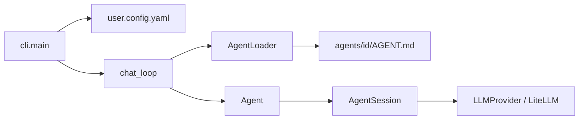

# ClawDog

**Your loyal AI assistant** — a Python CLI framework for running configurable AI agents in the terminal. Chat with persona-driven agents (like **Rex**), backed by [LiteLLM](https://github.com/BerriAI/litellm) for multi-provider LLM support (OpenAI, Anthropic, Ollama, and more).

The CLI shows a welcome panel with ASCII art, then an interactive loop: you type prompts, the agent replies in rendered Markdown.

## Features

- **Interactive terminal chat** — Rich-powered UI with welcome panel, ASCII art, Markdown replies, and quit/exit handling
- **Workspace-based configuration** — YAML config per workspace (`user.config.yaml`)
- **Agent definitions in Markdown** — Each agent lives in `agents/<id>/AGENT.md` with YAML frontmatter + system prompt body
- **Per-agent LLM overrides** — Workspace defaults merge with agent-specific `llm` settings
- **Session memory** — Conversation history within a chat session (user/assistant messages + system prompt)
- **Provider flexibility** — LiteLLM integration for local (Ollama) or cloud APIs

## Requirements

- Python **3.13+**
- [uv](https://github.com/astral-sh/uv) (recommended) or pip
- A running LLM backend (e.g. [Ollama](https://ollama.com) for local models)

## Quick start

```bash
# Install dependencies
uv sync

# Ensure your model is available (example: Ollama)
ollama pull gemma4

# Start a chat with the default agent (rex)
PYTHONPATH=src uv run python -m cli.main chat
```

Use a different workspace or agent:

```bash
PYTHONPATH=src uv run python -m cli.main -w /path/to/workspace chat
PYTHONPATH=src uv run python -m cli.main chat -a rex
```

Type `quit`, `exit`, or `q` to end the session.

## Project structure

```
ClawDog/
├── default-workspace/          # Default workspace (config + agents)
│   ├── user.config.yaml        # Workspace LLM settings and default agent
│   └── agents/
│       └── rex/
│           └── AGENT.md        # Agent persona (frontmatter + system prompt)
├── src/
│   ├── cli/                    # Command-line interface
│   │   ├── main.py             # Typer app: workspace load, `chat` command
│   │   └── chat_loop.py        # Interactive REPL (Rich prompts, async chat)
│   ├── core/                   # Agent runtime
│   │   ├── agent.py            # Agent + AgentSession (chat turn, history)
│   │   ├── agent_loader.py     # Load AGENT.md, merge LLM config
│   │   └── session_state.py    # Message list and system prompt for a session
│   ├── provider/
│   │   └── llm/
│   │       └── base.py         # LLMProvider (LiteLLM acompletion wrapper)
│   └── utils/
│       ├── config.py           # Pydantic models: Config, LLMConfig
│       ├── settings.py         # App settings (workspace path, config filename)
│       └── def_loader.py       # Parse YAML frontmatter from markdown definitions
├── pyproject.toml              # Dependencies and project metadata
├── .env                        # Optional overrides (WORKSPACE_PATH, etc.)
└── README.md
```

## How it works



1. **CLI** loads the workspace and validates `user.config.yaml`.
2. **Chat loop** resolves the agent id (`--agent` or `default_agent`), loads `AGENT.md`, and creates an `Agent` + `AgentSession`.
3. Each user message is appended to session history, sent to the LLM with the system prompt, and the assistant reply is stored and rendered as Markdown.

## Configuration

### Workspace: `user.config.yaml`

Lives in your workspace root (default: `default-workspace/user.config.yaml`). The `workspace` path is set automatically at load time.

```yaml
default_agent: rex
agent_path: agents

llm:
  provider: ollama              # e.g. openai, anthropic, ollama
  model: ollama/gemma4          # LiteLLM model string
  api_key: ""
  api_base_url: http://localhost:11434
  temperature: 0.7
  max_tokens: 2048
```

| Field | Description |
|-------|-------------|
| `default_agent` | Agent folder name under `agents/` |
| `agent_path` | Relative path to agent definitions (resolved under workspace) |
| `llm` | Default LLM settings for all agents |

### Environment (`.env`)

Optional overrides via pydantic-settings:

```env
WORKSPACE_PATH=default-workspace
WORKSPACE_FILE_NAME=user.config.yaml
```

### Agent: `agents/<id>/AGENT.md`

Each agent is a directory named by its id, containing `AGENT.md`:

```markdown
---
name: Rex
description: A friendly dog assistant for daily tasks and coding.
allow_skills: true
llm:
  temperature: 0.7
  max_tokens: 4096
---

You are Rex, a friendly dog assistant...

## Capabilities
- Answer questions and explain concepts
...
```

| Frontmatter field | Purpose |
|-----------------|--------|
| `name` | Display name |
| `description` | Short description |
| `llm` | Optional overrides merged onto workspace `llm` |
| Body (below `---`) | System prompt sent to the model |

Agent id = directory name (e.g. `rex` → `agents/rex/AGENT.md`).

## Tech stack

| Layer | Libraries |
|-------|-----------|
| CLI | [Typer](https://typer.tiangolo.com/), [Rich](https://rich.readthedocs.io/) |
| Config | [Pydantic](https://docs.pydantic.dev/), [PyYAML](https://pyyaml.org/) |
| LLM | [LiteLLM](https://github.com/BerriAI/litellm) |
| Settings | [pydantic-settings](https://docs.pydantic.dev/latest/concepts/pydantic_settings/) |

## Development

```bash
uv sync
PYTHONPATH=src uv run python -m cli.main --help
```

Pyright is configured in `pyproject.toml` with `venvPath` / `venv` pointing at `.venv`.

## License

See repository license (if applicable).
